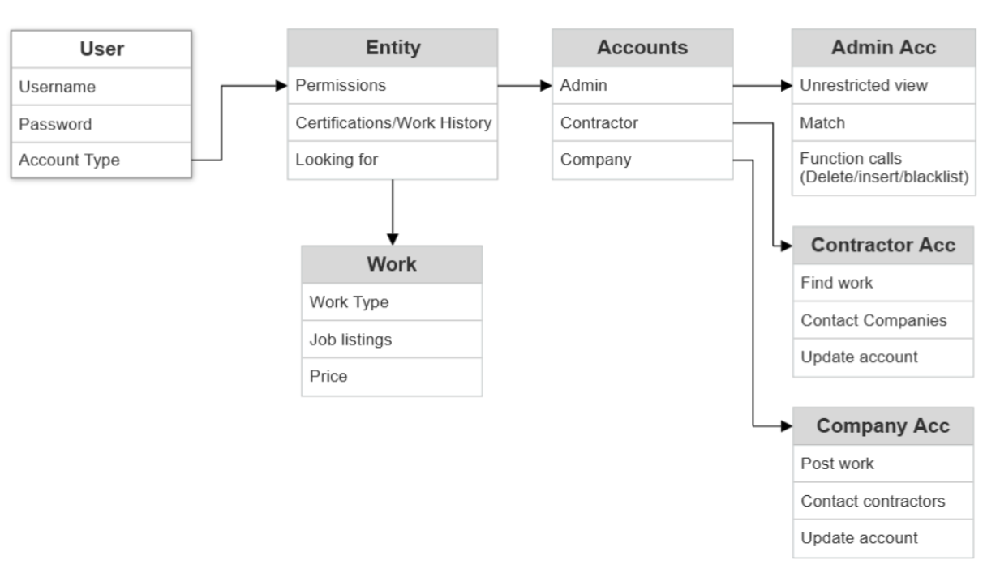
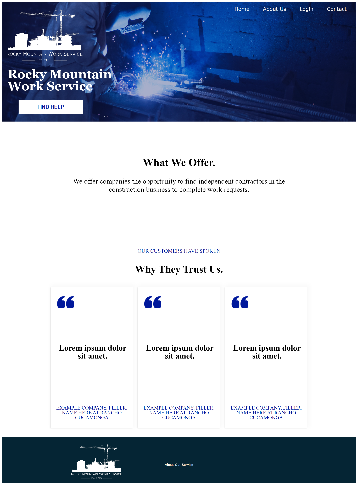
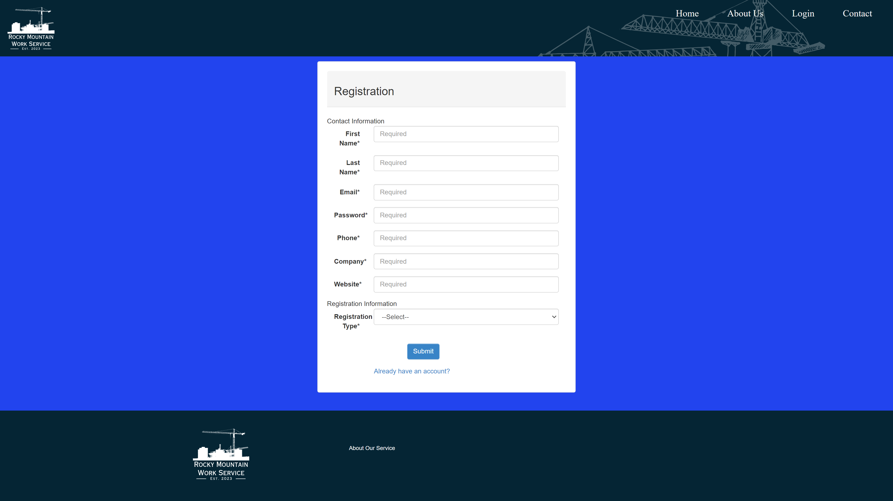
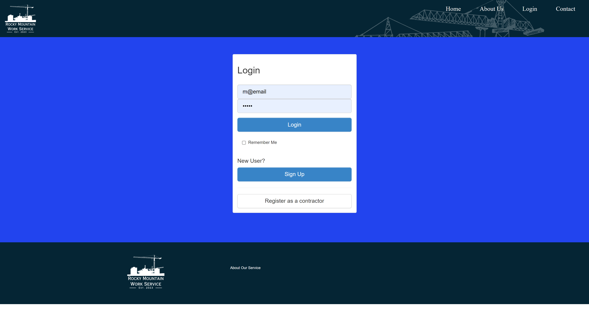
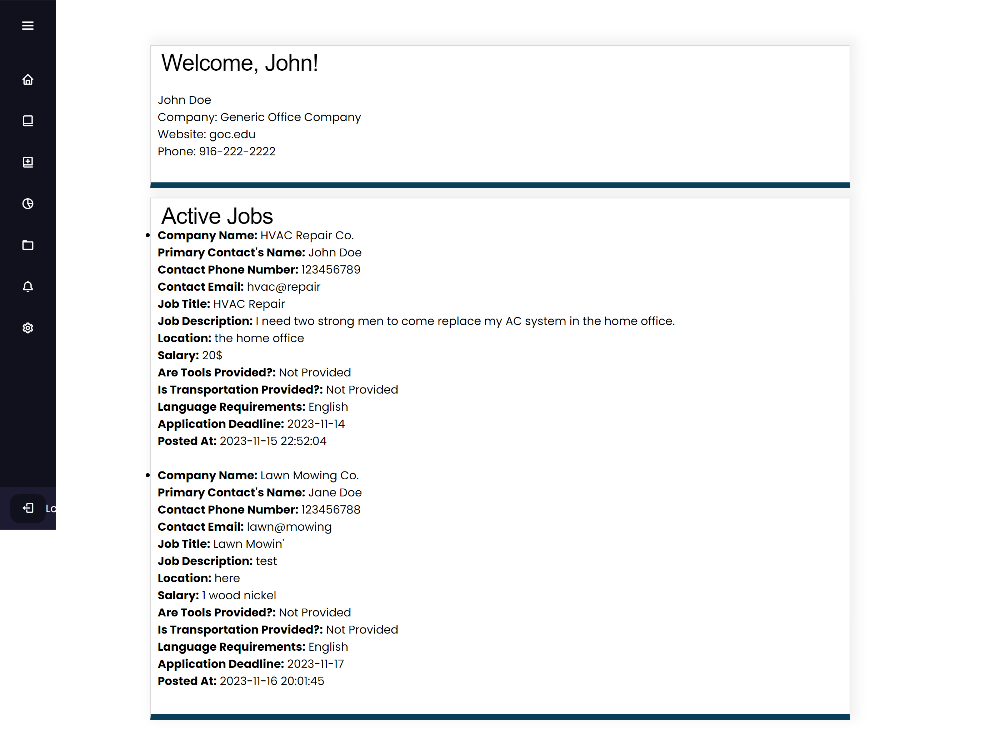
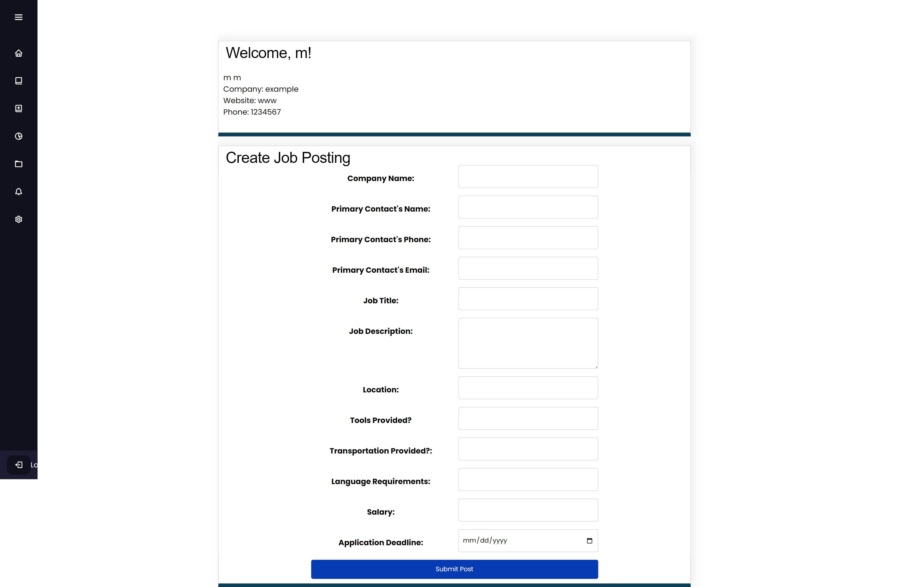
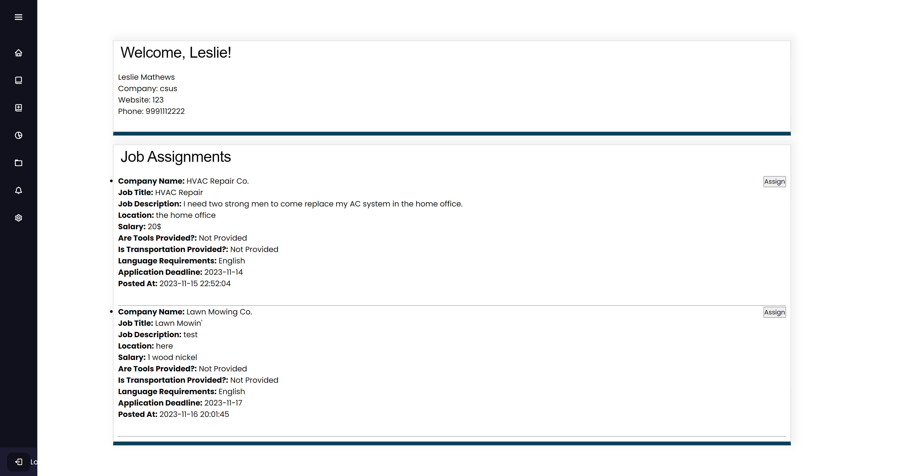

# Project Rocky Mountain Work Service by Team Lorem Ipsum

<!-- PROJECT SHIELDS -->
<!--ReadMe Template Credit: https://github.com/othneildrew/Best-README-Template/blob/master/README.md
*** Markdown "reference style" links for readability.
*** Reference links are enclosed in brackets [ ] instead of parentheses ( ).
*** See the bottom of this document for the declaration of the reference variables
*** for contributors-url, forks-url, etc. This is an optional, concise syntax you may use.
*** https://www.markdownguide.org/basic-syntax/#reference-style-links
-->
<!-- Must be enabled by git repo owner: 
[![Contributors][contributors-shield]][contributors-url] -->

<!-- PROJECT LOGO -->
<br />
<div align="center">
  <a href="https://github.com/Sarge02/Lorem-Ipsum">
    
  </a>

<h3 align="center">Rocky Mountain Work Service</h3>

  <p align="center">
    The purpose of this project is to build a website in which independent contractors working in construction can be matched with companies needing construction work done. The website would allow both the companies and the contractors to create accounts and submit work requests. The independent contractors would create a profile with their basic information. The companies will submit a work request form detailing the type of construction skills needed as well as other basic job information. The client will have administrative privileges to view the companies and contractors’ submissions, and then match accordingly. Key features of the website are its dashboard for all users which will easily display all actions one could take on the website, and a matching system that allows the administrator to assign contractors to companies' jobs.  
    <br />
    <br />
    <a href="https://github.com/Sarge02/Lorem-Ipsum"><strong>Explore the docs »</strong></a>
    <br />
    <br />
    <a href="https://github.com/Sarge02/Lorem-Ipsum">View Demo</a>
    
  </p>
</div>

<!-- TABLE OF CONTENTS -->
<details>
  <summary>Table of Contents</summary>
  <ol>
    <li>
      <a href="#about-the-project">About The Project</a>
      <ul>
        <li><a href="#features">Features</a></li>
        <li><a href="#built-with">Built With</a></li>
      </ul>
    </li>
    <li>
      <a href="#getting-started">Developer Instructions</a>
      <ul>
        <li><a href="#prerequisites">Prerequisites</a></li>
        <li><a href="#installation">Installation</a></li>
      </ul>
    </li>
    <li><a href="#deployment">Deployment</a></li>
    <li><a href="#timeline">Timeline & Milestones</a></li>
    <li><a href="#contact">Contact</a></li>
    <li><a href="#acknowledgments">Acknowledgments</a></li>
  </ol>
</details>
<br />

<!-- ABOUT THE PROJECT -->
## About The Project

<!--For when we have domain: [![Product Name Screen Shot][product-screenshot]](https://example.com) -->
<p> &nbsp &nbspThis platform will function as a mediator between employers and employees, allowing employers to request skilled tradesmen or entry-level laborers through the website. The platform will allow a user with administrative access to assign independent contractors to these jobs. </p>

<h3> How This Works:</h3>

<p>&nbsp &nbsp Unlike traditional job boards where employers post in search of employees and vice versa, Rocky Mountain Work Service will act as a middleman. Employers will come to the website and request a skilled tradesman or even an entry-level laborer. Titan Finder will then provide the employer with an employee that fits their needs. </p>

<div align="center">
   --------------------------Entity Relations Diagram (ERD)--------------------------<br />
  <br /><br />
  <br />
    --------------------------Home Page-------------------------- <br />
  <br /><br />
  --------------------------Registration Page--------------------------<br />
    <br /><br />
    --------------------------Login Page-------------------------- <br />
    <br /><br />
    --------------------------Contractor's Dashboard Page--------------------------<br />
    <br /><br />
    --------------------------Companies Dashboard Page--------------------------<br />
    <br /><br />
    --------------------------Admin Dashboard Page--------------------------<br />
    <br /><br />
  </div>
</div>


### Features
* Job Listings: Employers can submit job openings on your website, specifying the type of worker they need (skilled tradesman, entry-level laborer, etc.), the job location, and the duration of the job.
* Matching System: The website has a matching system to allow availible contractors and companies with work requests to be matched with each other for jobs.
* Worker Profiles: Workers can create profiles on your website, with all of their information.
* Job Board Management: As the middleman, you can manage the job board by reviewing job postings, verifying worker qualifications, and facilitating payments.
* Mobile Optimization: Your website should be optimized for mobile devices, making it easy for employers and workers to access and use on-the-go.


### Built With

* 
* [![Bootstrap][Bootstrap.com]][Bootstrap-url]
* 
* 
* ![Django][Django.com]

<p align="right">(<a href="#project-rocky-mountain-work-service-by-team-lorem-ipsum">back to top</a>)</p>

<!-- Dev Instructions -->
## Developer Instructions
<!-- ### Prerequisites This is an example of how to list things you need to use the software and how to install them. -->
### How to Push/Pull from Git

If your local machine has changes done that differ from the version in github it would be best to update github with the new changes. This means "push" the changes from the local machine to github. First the changes need to be commited. 
```sh
git add .
git commit -m "Your commit message"
```
Then push the changes.
```sh
git push <remote-name> <branch-name>
```
The opposite of pushing commits is to pull. Pulling from github refers to pulling from git to the local machine in order to make changes. 
```sh
git merge origin/main
```
If there are merge errors github will request the user to fix them then the pull is complete.

### Installation

 Clone the repo
   ```sh
   git clone https://github.com/Sarge02/Lorem-Ipsum.git
   ```
<p align="right">(<a href="#project-rocky-mountain-work-service-by-team-lorem-ipsum">back to top</a>)</p>

<!-- Deployment -->
## Deployment
 ### Deployment Process
 <p>
	Initial deployment is done using an Azure virtual machine, the operating system does not matter as the python code and modules used in our project are OS independent. <br> 
    The virtual machine launch settings are bog standard, meaning when deploying a new virtual machine for the first time you will use default settings for the latest Debian distribution. However the network settings need to be customized to access the network range we defined in our resource group for the public IP address and NAT forwarding rules. <br> If you are creating a new virtual machine due to a critical failure in troubleshooting you will have to dissociate the IP address from the old deleted virtual machine to free it for use. <br> The public IP address should now be available under the Public IP tab when setting up new virtual machines. <br>  Next we have to setup the necessary port forwarding rules in order to give the outside world access to the website hosted on the virtual machine. Enable SSH port 22 to access the virtual machine securely using a predefined service account, this can be disabled once deployment is finished for security hardening. You will also want to check port 80 for HTTP traffic forwarding. Currently we do not have SSL implemented nor any DNS A records linked to our public IP. If HTTPS is used, you will also enable HTTPS and optionally disable HTTP for further security hardening.


	After the networking setup is done you can click Review + Create in order to finish deploying the virtual machine.
  </p>

 ### Accessing the Virtual Machine
Once the virtual machine has been created you can access the resource by searching for virtual machines, this tab will show the newly created resource.
From the virtual machine’s dashboard, copy the public IP address. 

Next on your computer open a command prompt and enter the command below in order to connect to the virtual machine.
```sh
ssh SStalone01@20.163.18.235
```
The service account SStalone01 was defined in our deployment of the production virtual machine. This account password has been given to the product owner but can be reset using the virtual machine’s dashboard. Once successfully logged into the virtual machine you will see the prompt below.

 ### Prerequisites  
 <p>
	If this is a new deployment you will have to install the dependencies below in order to get the application running correctly.
  </p>

#### Install Git, PIP, & Python Packages
 <p> First install Git in order to pull the code repository from Github. Use the command below </p>

  ```sh
sudo apt-get install git
```
<p>Next install PIP to grab Django dependencies for app back-end functionality. Python3 comes pre-installed on default deployments of virtual machines in Azure but without the pip installer.</p>

  ```sh
  sudo apt-get install pip
  ```
  <p>Lastly use pip to install the necessary python packages for the Django project.</p>

```sh
pip install django
pip install django-cors-headers
```
#### Cloning the Repository
<p>We use git to clone the repository from Github. Use the command below in order to pull the latest version of the application’s source code.</p>

  ```sh
git clone https://github.com/Sarge02/Lorem-Ipsum.git
```
<p align="right">(<a href="#project-rocky-mountain-work-service-by-team-lorem-ipsum">back to top</a>)</p>

#### Running the Development Server
<p>Now we can start the server and make sure we are not missing any dependencies. Change into the project directory using the command below.</p>

  ```sh
cd RockyMountainWorkService
```
<p>Run the server using the command below.</p>

```sh
sudo python3 manage.py runserver 0.0.0.0:80
```
<p>If there are no errors you can proceed to the next section. If this is a new deployment of the project then you will have to modify the hosts list inside settings.py for the main application in order to let the outside internet access the Django endpoint. Close the server by hitting ctrl + c then change into the login_register folder using the command below.</p>

  ```sh
cd login_register
```
<p>Next modify the settings.py file using the built in text editor nano with the command below. Then navigate to the line that says ALLOWED_HOSTS = [ ]</p>

  ```sh
nano settings.py
```
<p>Add the public IP address you used to SSH into the virtual machine into the allowed hosts list.

Now Django references the public IP of the virtual machine and connections should go through according to the port we specify for the Django app and our port forwarding rule for HTTP on port 80.</p>
#### Running in the Background
<p>In order to keep the server running once we close the terminal session we use the process container tmux. Close the server by hitting Ctrl + C, then install tmux using the command below.</p>

```sh
sudo apt-get install tmux
```
<p>Now just run tmux by typing tmux into the console and hitting enter. The window should have a little green bar indicating you are running in a detachable session.

Now you rerun the same command to start the server again.</p>

  ```sh
sudo python3 manage.py runserver 0.0.0.0:80
```
<p>The website is now running as a background process, use ctrl + b then press d to detach from the tmux session. You can now close the command prompt window and the website will still be running for clients and contractors to access.</p>

### Post-Deployment Checks
<p>Verify the website is now accessible in the browser by entering the public IP address 20.163.18.235 into the search bar.

Create a new test account to verify the registration and login functionality works as expected, if there are errors they will be output to the Django console window.</p>

#### Identifying Deployment Issues 
<p>Deployment issues should have been ameliorated during the deployment process however if the website is not functioning correctly you can triage any errors by looking at the error logs in the console and referencing the deployment guide steps for the relevant error.</p>

### Rollback Procedure 
<p>If new code changes have broken some functionality or the entire application you can access previous github versions to restore the website to a working version by going to the Github repository directly and grabbing a previous branch’s github URL.</p>

### Rolling Back to the Previous Version
<p>With a previous but working version copied you can revisit the deployment process using this new link during the git clone step in section 4.3.2.</p>

<p align="right">(<a href="#project-rocky-mountain-work-service-by-team-lorem-ipsum">back to top</a>)</p>

<!-- CONTACT -->
## Contact
  Developers: Megan Gross, Ryan Sarginson, Sameer Shaik, Christian Villagran, Rafael Mercado, Daniel Mason, Covi Singh

Project Link: [https://github.com/Sarge02/Lorem-Ipsum](https://github.com/Sarge02/Lorem-Ipsum)

<p align="right">(<a href="#project-rocky-mountain-work-service-by-team-lorem-ipsum">back to top</a>)</p>

<!-- ACKNOWLEDGMENTS -->
## Acknowledgments

* []() California State University, Sacramento | Engineering and Computer Science Department

<p align="right">(<a href="#project-rocky-mountain-work-service-by-team-lorem-ipsum">back to top</a>)</p>


<!-- MARKDOWN LINKS & IMAGES -->
<!-- https://www.markdownguide.org/basic-syntax/#reference-style-links -->
[contributors-shield]: https://img.shields.io/github/contributors/Sarge02/Lorem-Ipsum.svg?style=for-the-badge
[Django.com]: https://img.shields.io/badge/django-%23092E20.svg?style=for-the-badge&logo=django&logoColor=white
[contributors-url]: https://github.com/Sarge02/Lorem-Ipsum/graphs/contributors
[Bootstrap.com]: https://img.shields.io/badge/Bootstrap-563D7C?style=for-the-badge&logo=bootstrap&logoColor=white
[Bootstrap-url]: https://getbootstrap.com
